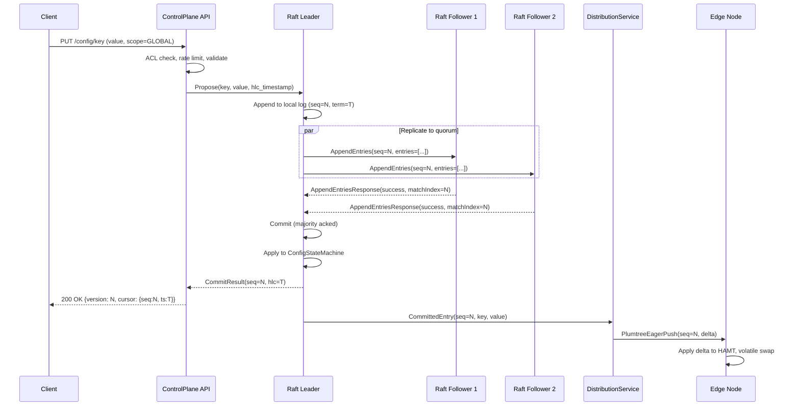
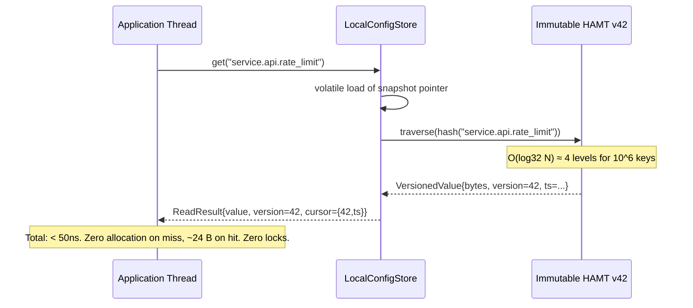
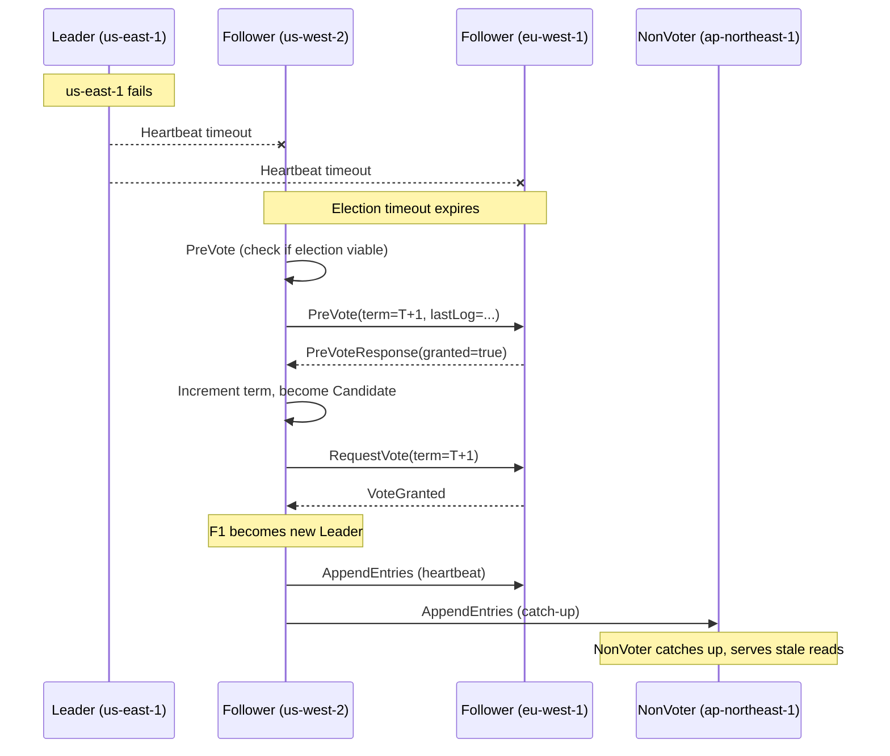
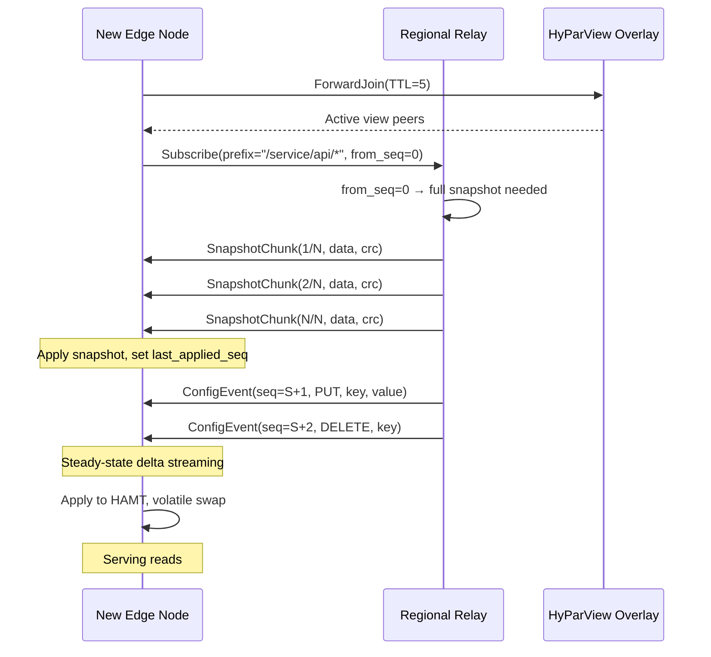

# Architecture — Configd: Next-Generation Global Configuration Distribution

> **Phase 2 deliverable.** Every component, message type, and version field is named.
> Reviewed by: principal-distributed-systems-architect, distributed-systems-researcher, performance-engineer.

---

## 1. Control Plane vs Data Plane Separation

```
┌─────────────────────────────────────────────────────────┐
│                    CONTROL PLANE                         │
│  Consistency: Linearizable (Raft)                       │
│  SLO: 99.999% availability, < 150ms write p99           │
│  Components: RaftGroups, ConfigStateMachine, AdminAPI    │
├─────────────────────────────────────────────────────────┤
│                    DATA PLANE                            │
│  Consistency: Bounded staleness (< 500ms p99)           │
│  SLO: 99.9999% read availability, < 1ms read p99        │
│  Components: DistributionService, EdgeCache, Plumtree   │
└─────────────────────────────────────────────────────────┘
```

### Control Plane Components
| Component | Responsibility |
|---|---|
| `GlobalRaftGroup` | 5 voters across 3+ regions. Handles GLOBAL-scope config writes. |
| `RegionalRaftGroup` | 3 voters per region. Handles REGIONAL-scope config writes. |
| `ConfigStateMachine` | Applies committed Raft entries to VersionedConfigStore. |
| `ControlPlaneAPI` | HTTP REST (JSON). Write requests, admin, ACL, audit. |
| `PlacementDriver` | Manages Raft group membership, shard metadata, scheduling. |

### Data Plane Components
| Component | Responsibility |
|---|---|
| `DistributionService` | Plumtree fan-out from Raft followers to edge nodes. |
| `HyParViewOverlay` | Peer sampling and overlay maintenance for Plumtree. |
| `EdgeCache` (library) | In-process HAMT, lock-free reads, version cursors. |
| `CatchUpService` | Delta replay / snapshot transfer for lagging nodes. |
| `StalenessTracker` | Monitors edge freshness, manages CURRENT→STALE→DEGRADED transitions. |

**Strict boundary:** The data plane never writes to Raft. The control plane never serves edge reads. Communication is one-way: control plane → data plane via committed log entries.

---

## 2. Write Path



### Latency Budget

| Stage | Intra-Region | Cross-Region (Global) |
|---|---|---|
| Client → API | < 1ms | < 1ms (nearest region) |
| API → Raft Leader | < 1ms | < 1ms (co-located) |
| Raft replication to quorum | **2-5ms** | **68ms** (us-east → eu-west) |
| Apply to state machine | < 1ms | < 1ms |
| Total write commit | **< 10ms** | **< 80ms** |
| Distribution to edge (p99) | **< 50ms** | **< 500ms** |

### Throughput: 10K/s sustained, 100K/s burst

- **Regional writes (60% of traffic):** 3 regional Raft groups × ~20K/s each = 60K/s capacity. At 6K/s per group = comfortable headroom.
- **Global writes (10% of traffic):** Single global group handling 1K/s. With batching (200μs bounded delay, up to 64 entries), effective throughput of 5K+ entries/s per batch cycle.
- **Local writes (30% of traffic):** Non-replicated, local-only. Limited only by local storage write speed.
- **Burst (100K/s):** Raft batching absorbs burst. 200μs batching window × 100K/s = 20 entries per batch average. Well within 64-entry batch limit.

### Batching Strategy
- **Bounded delay:** 200μs max wait before flushing batch (not Quicksilver's fixed 500ms).
- **Size trigger:** Flush immediately at 64 entries or 256 KB.
- **Adaptive:** Under low load, send immediately (< 5 pending). Under high load, batch to max delay.

---

## 3. Read Path



### Single-Writer / Multi-Reader Model
- **Writer thread:** Single `DeltaApplier` thread receives Plumtree events, applies mutations to current HAMT (producing new HAMT with structural sharing), stores new reference to `volatile` field.
- **Reader threads:** Any application thread. Single volatile load acquires current immutable snapshot. HAMT traversal is pure function over immutable data.
- **Guarantee:** Reader never blocks writer. Writer never blocks reader. No locks, no CAS, no `synchronized` anywhere on the read path.

### Version Cursor for Monotonic Reads
```java
ReadResult result = store.get("key");
// result.cursor() = VersionCursor{version=42, timestamp=1700000000000}

// Later read with cursor enforcement:
ReadResult next = store.get("key", previousCursor);
// If store version < cursor.version: blocks briefly or returns stale-flagged
assert next.version() >= previousCursor.version(); // Always true
```

---

## 4. Replication Topology — Hierarchical Raft (ADR-0002)

```
                    ┌──────────────────────┐
                    │   GLOBAL RAFT GROUP   │
                    │  5 voters across 3    │
                    │  regions for GLOBAL   │
                    │  config keys          │
                    └──────────┬───────────┘
                               │
              ┌────────────────┼────────────────┐
              │                │                │
    ┌─────────▼──────┐ ┌──────▼────────┐ ┌─────▼─────────┐
    │ REGIONAL GROUP │ │ REGIONAL GROUP│ │ REGIONAL GROUP│
    │  US (3 voters) │ │  EU (3 voters)│ │  AP (3 voters)│
    │  REGIONAL keys │ │  REGIONAL keys│ │  REGIONAL keys│
    └────────┬───────┘ └──────┬────────┘ └──────┬────────┘
             │                │                 │
    ┌────────▼────────────────▼─────────────────▼────────┐
    │              PLUMTREE FAN-OUT LAYER                  │
    │  (Non-consensus, push-based, O(N) messages)         │
    │  HyParView overlay for peer discovery               │
    ├─────┬─────┬─────┬─────┬─────┬─────┬─────┬─────┤
    │Edge │Edge │Edge │Edge │Edge │Edge │Edge │Edge │
    │Node │Node │Node │Node │Node │Node │Node │Node │
    │  1  │  2  │  3  │  4  │  5  │  6  │  7  │  8  │
    └─────┴─────┴─────┴─────┴─────┴─────┴─────┴─────┘
```

### Config Key Routing by Scope
| Scope | Raft Group | Commit Latency | Example Keys |
|---|---|---|---|
| `GLOBAL` | Global group (5 voters across regions) | ~68ms | `global.routing.rules`, `security.tls.policy` |
| `REGIONAL` | Regional group (3 voters in region) | ~3ms | `us.feature.flags`, `eu.capacity.limits` |
| `LOCAL` | None (local only) | < 1ms | `node.debug.level`, `node.tuning.gc` |

### Non-Voting Replicas
Each regional group has non-voting replicas in other regions for:
- Cross-region stale reads (bounded by closed timestamp, ~3s staleness like CockroachDB)
- Faster catch-up after region failover
- No impact on write quorum latency

---

## 5. Multi-Region Strategy

### Region Tiers
| Tier | Role | Example |
|---|---|---|
| **Core** (3 regions) | Global Raft voters. Full dataset. | us-east-1, eu-west-1, us-west-2 |
| **Regional** (N regions) | Regional Raft groups. Full regional dataset. Non-voting global replicas. | ap-northeast-1, ap-southeast-1, sa-east-1 |
| **Edge** (10K-1M nodes) | Plumtree consumers. Working set only. No Raft participation. | CDN PoPs, edge servers |

### Follower Reads with Bounded Staleness
Inspired by CockroachDB's closed timestamp mechanism:
1. Each Raft leader periodically advances a **closed timestamp** — a promise that no new writes will occur at or below that timestamp.
2. Non-voting replicas in remote regions track this closed timestamp.
3. Reads at timestamps ≤ closed timestamp can be served locally without leader contact.
4. Default closed timestamp target: 3 seconds in the past.
5. Side-transport publishes closed timestamp updates every 200ms for idle Raft groups.

### Region Loss Scenarios

| Scenario | Impact | Recovery |
|---|---|---|
| Loss of non-core region | Regional keys unavailable for writes. Edge reads continue from stale cache. | Promote non-voting replica to voter in surviving region. |
| Loss of 1 core region (minority) | Global writes continue (3 of 5 voters remain). | Replace lost voters from surviving core regions. |
| Loss of 2 core regions (majority) | Global writes unavailable. Regional writes continue. Edge reads continue. | Manual intervention required. Consider emergency reconfiguration. |
| Edge node loss | No impact on system. Other edges unaffected. | New edge bootstraps via snapshot + delta catch-up. |

---

## 6. Failure Handling

### Leader Isolation
- **CheckQuorum:** Leader steps down if no majority heartbeat within election timeout (150-300ms).
- **PreVote:** Prevents term inflation from partitioned nodes attempting elections.
- **Leadership transfer:** Graceful leader movement for maintenance (catches up target, sends TimeoutNow).

### Asymmetric Partitions
Node A reaches B and C; B reaches A but not C. Mitigation:
- CheckQuorum on leader detects loss of majority responsiveness.
- PreVote prevents disconnected nodes from disrupting the cluster.
- Multi-dimensional health monitoring detects gray failures (heartbeats pass but data plane fails).

### Clock Skew
- HLC-based, not TrueTime. No hardware dependency.
- Maximum tolerated clock skew: 500ms (configurable). Nodes with clock drift > threshold are fenced.
- HLC guarantees causal ordering regardless of clock skew (logical counter compensates).

### Gray Failures
Health monitoring beyond Raft heartbeats:
- **Data-plane latency:** Track p99 of actual AppendEntries round-trip, not just success/failure.
- **Disk I/O latency:** fsync latency > 1s triggers voluntary leader step-down.
- **Memory pressure:** Heap usage > 90% triggers write rejection (load shedding).
- **Network quality:** Packet loss > 5% triggers peer quality degradation alert.

---

## 7. Fan-out Distribution (ADR-0003)

### Push via Plumtree over HyParView

**Plumtree parameters:**
- Eager push peers: log(N)+1 (tree edges, receive full payload)
- Lazy push peers: 6×(log(N)+1) (overlay edges, receive IHave digests)
- IHave gossip interval: 500ms
- GRAFT timeout: 1s (if IHave received but payload not yet seen)

**HyParView parameters:**
- Active view size: log(N)+1
- Passive view size: 6×(log(N)+1)
- Shuffle period: 30s
- Join TTL: log(N)+1

### Backpressure Model
Credit-based flow control per child:
- Initial credits: 100
- Each message consumes 1 credit
- ACK replenishes credits
- At 0 credits: buffer (bounded, 1000 entries max)
- Buffer full at 80%: slow consumer warning (`configd.distribution.slow_consumer` metric)
- Buffer full at 100%: disconnect child

### Catch-up Protocol
1. Edge node compares `last_applied_seq` with parent's latest sequence.
2. If gap < compaction window: parent streams deltas from WAL.
3. If gap > compaction window: parent sends chunked snapshot, then streams deltas from snapshot point.
4. Chunked snapshot: 1 MB chunks, CRC per chunk, resume on failure.

### Version Gap Detection
```
if received_seq == last_applied_seq + 1:
    apply normally
elif received_seq > last_applied_seq + 1:
    GAP DETECTED → enter catch-up mode
elif received_seq <= last_applied_seq:
    DUPLICATE/STALE → discard
```

### Slow Consumer Policy
| Condition | Action |
|---|---|
| 0 credits for > 10s | Warning log + metric |
| 0 credits for > 30s | Disconnect from tree, mark as quarantined |
| Quarantined | Must re-bootstrap via catch-up protocol |
| 3 quarantines in 1 hour | Marked as unhealthy, removed from distribution tree |

### Subscription Model
- **Prefix-based (primary):** Edge nodes subscribe to key prefixes matching needed namespaces.
- **Full-store:** Regional relay nodes only. Receive all events.
- **Per-key:** Supported but discouraged (use prefix with specific key).

---

## 8. Edge Caching (ADR-0005)

### HAMT with Structural Sharing
- 32-way branching (5 bits per level of hash)
- 4 levels for 10^6 keys, 6 levels for 10^9 keys
- `put()` clones only the path from root to modified leaf (~6 nodes for 10^6 keys, ~32 KB)
- Old versions eligible for GC once no readers hold references

### Delta Application
```java
// DeltaApplier thread (single writer)
void applyDelta(ConfigDelta delta) {
    ConfigSnapshot current = this.currentSnapshot; // volatile read
    HamtMap<String, VersionedValue> newData = current.data();
    for (ConfigMutation m : delta.mutations()) {
        switch (m) {
            case Put p -> newData = newData.put(p.key(), 
                new VersionedValue(p.valueUnsafe(), delta.toVersion(), timestamp));
            case Delete d -> newData = newData.remove(d.key());
        }
    }
    this.currentSnapshot = new ConfigSnapshot(newData, delta.toVersion(), timestamp);
    // volatile write — StoreStore barrier publishes new snapshot to all readers
}
```

### Negative Caching
- Maintain a key-only index (all known keys without values) on each edge proxy.
- Bloom filter for fast rejection of non-existent keys (~10 bits/key, 1% false positive rate).
- For 10^6 keys: ~1.2 MB Bloom filter. For 10^9 keys: ~1.2 GB (too large — use prefix-based subscription to limit key count per edge node).

### Poison-Pill Handling
- **Dual-TTL:** Soft TTL triggers background refresh; hard TTL evicts even if refresh fails.
- **Version format checks:** Validate value schema before deserialization.
- **Circuit breaker:** If value fails validation, serve previous known-good version. Emit `configd.edge.poison_pill` metric.

---

## 9. Consistency Contract

See `docs/consistency-contract.md` for full specification.

**Summary:**
| Property | Guarantee |
|---|---|
| Write linearizability | Per Raft group |
| Edge read consistency | Bounded staleness (< 500ms p99) |
| Monotonic reads | Per client session (via version cursor) |
| Read-your-writes (same region) | Guaranteed with 100ms timeout fallback |
| Per-key total order | Guaranteed (Raft serialization) |
| Cross-group ordering | Not guaranteed (HLC approximate) |

---

## 10. Diagrams

### Write Commit Flow
See §2 sequence diagram.

### Region Failover



### New Edge Node Bootstrap



---

## 11. Backpressure & Overload Policy

### Per-Path Policy

| Path | Trigger | Action | Client Signal | Recovery |
|---|---|---|---|---|
| **Write** | Raft queue > 1000 entries | Reject new writes | HTTP 429 + `Retry-After: 1` | Accept when queue < 500 (hysteresis) |
| **Write** | Raft apply lag > 5000 entries | Reject new writes + alert | HTTP 503 | Accept when lag < 1000 |
| **Read (edge)** | N/A (lock-free) | N/A | N/A | N/A (always fast) |
| **Read (control plane)** | ReadIndex queue > 100 | Reject linearizable reads; suggest stale | HTTP 429 | Accept when queue < 50 |
| **Fan-out** | Output buffer > 80% per child | Slow consumer warning | `X-Configd-Stale: true` on edge responses | Normal when buffer < 50% |
| **Fan-out** | Output buffer 100% per child | Disconnect slow consumer | Edge reconnection required | Re-bootstrap via catch-up |

### Load Shedding Order
When system is overloaded, shed in this order (least important first):
1. Stale reads from distant regions (redirect to closer edge)
2. Low-priority write requests (based on producer priority)
3. Linearizable read requests (suggest stale reads)
4. Normal write requests (429 with backoff)
5. **Never shed:** Edge read serving from local HAMT (always served, lock-free)

---

## 12. Network & WAN Modeling

### Cross-Region RTT Matrix

| Route | RTT (ms) | Used For |
|---|---|---|
| us-east-1 ↔ us-west-2 | 57 | Global Raft quorum |
| us-east-1 ↔ eu-west-1 | 68 | Global Raft quorum |
| us-east-1 ↔ eu-central-1 | 92 | Regional relay |
| us-east-1 ↔ ap-northeast-1 | 148 | Non-voting replica |
| us-east-1 ↔ ap-southeast-1 | 220 | Non-voting replica |
| eu-west-1 ↔ eu-central-1 | 20 | EU regional Raft |
| ap-northeast-1 ↔ ap-southeast-1 | 69 | AP regional Raft |

### Tail Amplification for Fan-out Tree

For a 2-tier tree (k=16 at tier 1, k=64 at tier 2) reaching 1024 edges:
- To achieve p99 at root: each tier-1 child must achieve p99.94
- Each tier-2 leaf must achieve p99.98
- **Mitigation:** Hedged requests at each tier — send to 2 children, use first response.

### WAN Partition Scenarios

| Scenario | Behavior | Traceable to |
|---|---|---|
| Single region isolated | Raft groups with majority in surviving regions continue. Isolated region's edge nodes serve stale. | INV-S1 (staleness bound) |
| Split-brain (2+3 partition) | Majority partition (3) continues. Minority partition (2) steps down leaders. | Election Safety (INV-L1) |
| Asymmetric partition | PreVote prevents term inflation. CheckQuorum forces isolated leader step-down. | Raft liveness properties |
| Submarine cable cut | Edge nodes in affected regions serve stale. Recovery when cable restored or traffic rerouted (+100-200ms latency). | INV-S1 (DEGRADED state) |
