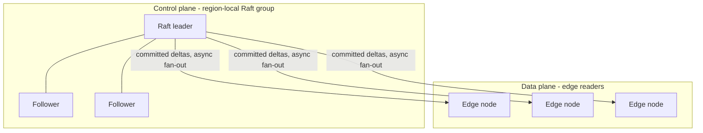
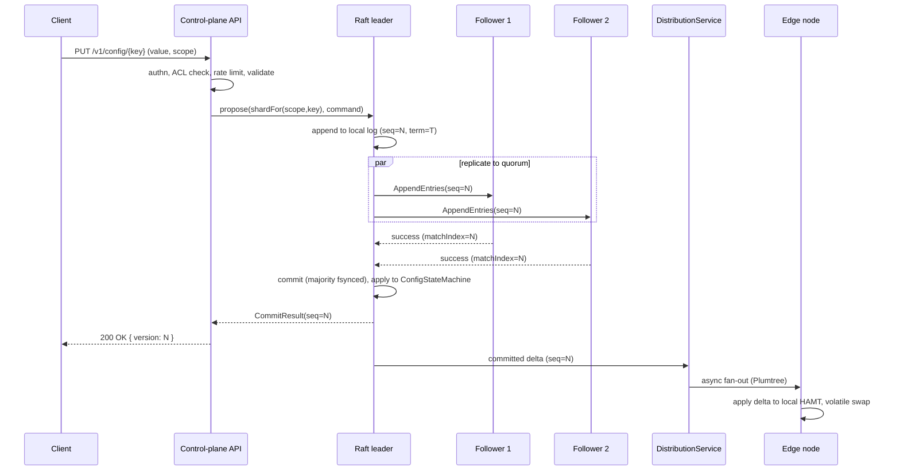
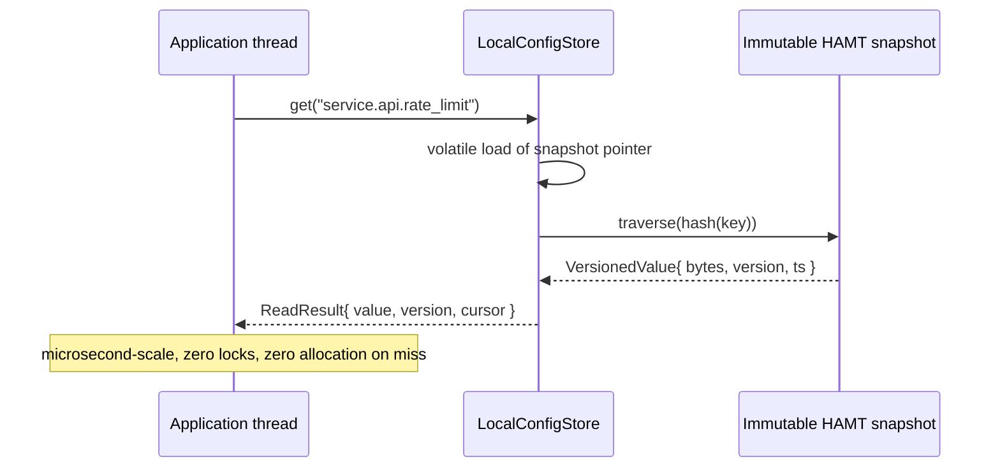

# Configd Architecture

Configd is a region-local, strongly-consistent configuration control plane. Writes go
through a Raft group for durable, linearizable ordering; reads are served from a lock-free,
in-process cache at the edge in microseconds. The shape is deliberately Quicksilver-like: one
Raft root of truth for writes, plus asynchronous, bounded-staleness fan-out to edge readers
that hold a local copy and take no part in consensus (ADR-0030).

This document describes the system as it runs today. Where a capability is out of scope, it says
so; see [`../operations/known-limitations.md`](../operations/known-limitations.md) for the full
list. The load-bearing consensus threading rules live in a companion spec:
[`raft-threading-contract.md`](raft-threading-contract.md).

## What it does (and does not do)

Configd is a **single, region-local sharded-Raft cluster**. It is NOT a global, multi-region,
hierarchical-Raft write topology. An earlier design proposed a global Raft group plus per-region
groups with closed-timestamp follower reads; that design was rejected on cross-region write-latency
arithmetic and operational complexity (ADR-0030), and the write-availability target was formally
renegotiated (ADR-0031). None of it was built.

What it actually runs:

- **One region-local Raft group by default (N=1).** Hash-within-scope sharding is wired and
  measured; a multi-shard deployment (N>1) is supported, with leadership maintained by a built-in
  auto-balancer (the measured 2.45x was under manual placement -- see Sharding and Measured envelope, below).
- **Centralized writes, asynchronous edge reads.** All linearizable writes commit in the root
  group. Committed deltas fan out to edges that serve sequentially-consistent, bounded-stale reads.
- **Single region.** Cross-region / WAN write consensus is explicitly out of scope
  (ADR-0024, ADR-0030). A full-region loss requires manual standby cutover; sub-second region
  failover is not implemented.

## Control plane and data plane

Configd separates a strongly-consistent control plane from a bounded-staleness data plane. The
boundary is one-way and strict.

| Plane | Consistency | Serves | Key components |
|---|---|---|---|
| Control plane | Linearizable (Raft) | Writes, admin, ACL, audit; linearizable reads via ReadIndex | `RaftNode`, `ConfigStateMachine`, `VersionedConfigStore`, the control-plane API |
| Data plane | Bounded staleness | Edge reads (lock-free, in-process) | `DistributionService`, `LocalConfigStore` (edge HAMT), `StalenessTracker` |

Strict boundary: the data plane never writes to Raft, and the control plane never serves edge
reads. Communication is one-way -- the control plane pushes committed log entries down to the data
plane; nothing flows back up the read path.

## Topology

A typical deployment is a small, region-local Raft group (typically 3 voters across availability zones
for automatic single-AZ survival) plus a fan-out tree of edge readers.

Voters are placed across at least three availability zones (or nearby sub-100ms DCs) in one
region, so the loss of any single AZ leaves a majority and triggers automatic Raft election
(PreVote + CheckQuorum) with no operator and no split-brain (ADR-0030 amendment A2). The commit
floor stays in the single-digit-millisecond range because the quorum is intra-region.

## Write path

Writes are linearizable and durable. Configd acknowledges only after the root group's majority has
durably fsynced the entry -- there is no early ack (ADR-0033).

Overload is bounded, not silent: when the leader has about **1024** in-flight (uncommitted)
proposals, new writes are rejected with **HTTP 429** plus `Retry-After` (the `maxPendingProposals`
bound in `RaftConfig`, default 1024). This is a single hard, level-triggered bound that caps leader
memory; it recovers as soon as in-flight drops below the bound. Rate limiting also runs
unconditionally in front of Raft.

## Read path

There are two kinds of read, with two different guarantees.

**Edge reads (the common case).** An application thread calls into the local edge store
(`LocalConfigStore.get`). The read is a single volatile load of the current immutable snapshot
pointer followed by a HAMT traversal -- lock-free, allocation-free on a miss, and served in
microseconds (measured in-process p50 around 50 ns; getHit around 483 ns at 100M keys). Edge reads
are **sequentially consistent and bounded-stale, never linearizable**, and are never shed.

**Linearizable reads (control plane).** For read-after-write correctness and for the strong-read
key class, the control plane serves a linearizable read via Raft **ReadIndex** against the leader.
If leadership or the ReadIndex confirmation is unavailable, the read fails closed with **HTTP 503**
(plus a leader hint) rather than returning a possibly-stale value.

The strong-read key class (default prefix `secure/`) is exempt from bounded-stale edge serving:
security-critical decisions (ACL/auth revocations, kill-switches, legal gates) MUST use the
linearizable path and MUST fail closed when it is unavailable (ADR-0030 amendment A1). Note that
`secure/` buys read **freshness**, not confidentiality -- see Security posture.

## Sharding: hash within scope

The write seam routes each key to a shard (a Raft group) by hashing the full key within its scope
tier: `shardFor(scope, key) = hash(namespace, key) mod N_scope` (ADR-multiraft-partitioning). Hash
(not range) is the deliberate choice: edge reads are point lookups with no range scans, so range
partitioning would buy nothing and reintroduce the single-hot-shard write collapse; hash disperses
bursty prefixes across all shards by construction.

- `ConfigScope` selects the pool of groups (and voter topology) for a key; the hash selects the
  group within that pool. This replaces a single constant group id at the existing
  `ConfigWriteService.propose(scope, cmd)` -> `MultiRaftDriver.propose(groupId, cmd)` seam.
- **N=1 is the default and is byte-identical to a non-sharded build** -- a `StaticShardMap(1)`
  routes every key to the one group. Shard count is set with `-Dconfigd.raft.shardCount=N`.
- Each group is owned by exactly one owner thread for the life of the process; different groups may
  progress on different threads (the throughput unlock), the same group never does (the safety
  invariant). This is the subject of [`raft-threading-contract.md`](raft-threading-contract.md).
- Fan-out is unchanged by sharding: the distribution tier already ingests every committed delta and
  localizes per-key deltas to subscribed edges via a radix trie, so shard layout never reaches an
  edge.

Dynamic resharding (online split/merge/rebalance) is not implemented; it is designed behind the
same `ShardMap` interface (ADR-multiraft-topology). Configd ships `StaticShardMap` with a fixed N.

## Consensus, replication, and durability

The consensus core is a full, tick-driven Raft implementation:

- Leader election with **PreVote** (avoids term inflation from partitioned nodes) and
  **CheckQuorum** (a leader without majority contact steps down).
- Log replication with batching; **no early ack** -- commit requires a durable majority fsync.
- **Leadership transfer** (TimeoutNow, `RaftNode.transferLeadership`) is exposed on the ADMIN-gated
  `POST /v1/admin/groups/{gid}/transfer-leadership` route **and** driven automatically by a decentralized
  **leadership auto-balance loop** (`LeaderBalanceLoop`, one per node, on by default at N>1, sheds one
  over-owned leader per cycle). It is not yet invoked to hand off leadership on graceful shutdown (see
  Measured envelope and What it does not do, below).
- **Joint-consensus reconfiguration** and no-op commit on election.
- At-rest durability artifacts (snapshot blob, WAL records, persistent Raft state) carry an
  integrity envelope (below).

**Chunked snapshot transfer.** A large snapshot streams to a lagging follower as **ordered chunks**
(each ≤ 4 MiB = `MAX_SNAPSHOT_CHUNK_BYTES`, default chunk 1 MiB), driven off the follower's echoed
`nextExpectedOffset`; the follower installs only after the whole snapshot is reassembled in order. This
lifts the old 4 MiB single-frame total-state ceiling. The total is now bounded by the follower's **heap**
and a fail-closed cap (`configd.raft.maxReassembledSnapshotBytes`, default 512 MiB) that refuses an over-cap
reassembly (drop the partial, log `SEVERE`, no install/OOM) rather than wedging silently. Observability:
`configd_snapshot_bytes` (snapshot size vs the per-chunk cap),
`raft_shard_snapshot_reassembly_refused_<gid>`, and `raft_shard_replication_lag_max_<gid>` (the follower-lag
proxy). Disk-spilling reassembly is a later item.

## Fan-out distribution to the edge

Committed deltas are pushed down a distribution tree (Plumtree over a HyParView peer-sampling
overlay, ADR-0011) to edges that hold a local copy. Edges detect gaps via a gap-free monotonic
sequence number (a received seq exactly one past the last applied is applied; a larger seq triggers
catch-up; a smaller-or-equal seq is a duplicate and discarded).

**Backpressure is bounded queues plus cursor-acknowledged demotion**, not credits. Each fan-out
session owns a bounded outbound frame queue; sustained queue pressure raises a slow-consumer
warning metric; queue overflow or cursor-ack lag past threshold demotes the session to catch-up
(snapshot then resume) -- never an unbounded buffer, never a silent drop (`FanOutSessionCore`). A
per-identity `SlowConsumerGovernor` ladder escalates repeat offenders (SLOW -> CATCHUP ->
QUARANTINED -> UNHEALTHY) with a metric, a structured log, and a test at every transition, keyed to
the mTLS certificate principal so reconnect storms cannot dodge it.

**Catch-up.** An edge resumes from its cursor: if within the replay horizon, the parent streams
deltas from the commit-notification boundary; if the gap is larger, the parent sends a chunked
snapshot and then streams deltas from exactly snapshot-seq + 1. Recovery is transfer-level, not
chunk-level -- an unacknowledged transfer re-triggers and the whole snapshot is idempotently
re-sent until cursor-acknowledged; under transport backpressure the in-flight envelope pauses at the
exact frame and resumes on the next tick.

## Edge caching

The edge store is a persistent Hash Array Mapped Trie (HAMT) with structural sharing:

- 32-way branching; a `put` copies only the root-to-leaf path, so old snapshots stay valid for
  in-flight readers and become GC-eligible once no reader holds them.
- **Single writer, many readers.** A single delta-applier thread builds the next immutable snapshot
  and publishes it with one volatile write (a StoreStore barrier makes it visible to all readers).
  Readers take a single volatile load and traverse pure immutable data -- reader never blocks writer,
  writer never blocks reader, no locks anywhere on the read path.
- **Monotonic reads** via an opaque `VersionCursor`: a read carrying a cursor never returns a value
  older than the cursor's version.
- **Staleness tracking.** `StalenessTracker` measures age against the leader-assigned commit
  timestamp carried on each notification (ADR-0035/ADR-0039) and transitions
  CURRENT -> STALE -> DEGRADED -> DISCONNECTED, surfacing an `X-Configd-Stale` header while behind.
- **Poison-pill handling.** A value that fails validation serves the previous known-good version and
  emits a metric rather than propagating a bad entry.

## Watches

Configd implements the server side of the RFC 2 driver-protocol watch surface on the edge endpoint
(`--edge-port`): a vector-native per-shard cursor `(gid, seq)`, the `WATCH_*` frames, a
multiplex/filter veneer, a whole-target authorization gate (`READ and WATCH`, reject-not-filter,
fail-closed), per-watch filtered delivery with catch-up snapshots, and bounded revocation under a
live ACL reload.

Guarantees to rely on: **per-key and per-shard order** (never cross-shard / global order);
batch-atomic per shard-commit; **at-least-once with `(gid, seq)` dedup** (the driver drops
`seq <= cursor[gid]`); bounded-staleness (edge-served, ordered, not linearizable -- use the strong
path for read-after-write). **Multi-shard (N>1) watches ship** -- a server-side aggregating coordinator runs
one `FanOutSessionCore` per covered shard behind one connection, tagging every event `(gid, S)` with a
per-shard cursor vector and independent per-shard resume. Ordering stays **per-shard, never cross-shard /
global** (different `gid`s are concurrent); a globally-ordered cross-shard watch is out of scope by design (no
global clock). The remaining watch deferral is the disjoint sharded-edge topology (edges serving shard
subsets, driver-side merge).

A conforming **Java** reference client ships (`configd-client` + `-core`/`-http`/`-edge`), plus a
`configd-conformance` suite (CI-wired, both planes, against the golden vectors). The RFC
([`../rfc/driver-protocol/`](../rfc/driver-protocol/)) is stand-alone implementable with golden byte vectors,
so drivers in other languages are buildable on demand and validate against the same goldens. See
[`../operations/known-limitations.md`](../operations/known-limitations.md) for the watch
deployment-security model (segregate watch clients from the legacy whole-store SUBSCRIBE path).

## Consistency contract

The full contract is [`../operations/consistency-contract.md`](../operations/consistency-contract.md).
In summary:

| Property | Guarantee |
|---|---|
| Write linearizability | Per Raft group (per-key total order) |
| Linearizable reads | Control plane via ReadIndex; fail-closed if unconfirmed |
| Edge read consistency | Bounded staleness (sequentially consistent, not linearizable) |
| Monotonic reads | Per client, via `VersionCursor` |
| Strong-read key class | `secure/` always read fresh (linearizable, fail-closed) |
| Cross-group ordering | Not guaranteed (independent per-group sequences) |

## Overload and backpressure

There is no priority scheduler; overload behavior is the emergent result of a few independent,
level-triggered mechanisms.

| Path | Trigger | Action | Client signal |
|---|---|---|---|
| Write | In-flight proposals reach about 1024 | Reject new writes (bounds leader memory) | HTTP 429 + `Retry-After` |
| Write (apply backlog) | `commitIndex - lastApplied` rising | Observability only (`raft_pending_apply_entries` gauge + warn alert); the 1024 bound already sheds upstream | -- |
| Read (edge) | n/a (lock-free local HAMT) | Never shed | `X-Configd-Stale: true` while behind |
| Read (control plane, linearizable) | Leadership / ReadIndex unconfirmed | Fail closed | HTTP 503 (+ leader hint) |
| Fan-out | Queue over threshold / ack-lag | Slow-consumer warning, then demote to catch-up | Edge re-bootstrap |

Effective load-shed order, in practice: linearizable control-plane reads fail closed first; normal
writes shed with 429 next; edge reads from the local HAMT are never shed.

## Security posture

Configd has a real, code-wired security model. It is **secure-by-config, not secure-by-default**: except
for rate limiting (and write-admission control, now on by default), every control is off until an operator
enables it (each emits a loud startup warning when off). Enabling auth + TLS + audit + replay before
production is a documented release gate ([`../operations/operator-runsheet.md`](../operations/operator-runsheet.md),
[`../operations/deployer-must-know.md`](../operations/deployer-must-know.md)). **The default bind is
loopback (`127.0.0.1`)**, and binding a non-loopback interface while auth is OFF is **refused** unless the
operator sets `-Dconfigd.security.allowInsecurePublicBind=true` (a footgun-fix against silent unauthenticated
public exposure -- not "auth required by default"; a deliberate no-auth public deployment stays possible via
the override).

- **Transport (mTLS per surface, but the surfaces differ).** The edge fan-out surface uses **mTLS
  with certificate-DN identity**. The Raft/admin control-plane API port is **HTTPS with a bearer
  token**, not client-certificate mTLS -- a bearer match authenticates as `root`. The client-facing
  edge-read HTTP surface is plaintext by design (ADR-0043). All four network surfaces run on Netty
  4.2.
- **Authentication (pluggable SPI, four modes).** Authentication resolves through **one pluggable
  authenticator chain** shared by both planes (`AuthenticatorChain`/`AuthenticatorFactory`, ServiceLoader),
  supporting **No-Auth / HTTP Basic / Bearer (incl. OIDC-validated JWT via `configd-authn-oidc`) / mTLS**. The
  edge accepts an mTLS client cert **and/or** a token/basic `AUTH` frame (RFC §06 §6A), with credential
  expiry/revocation and proactive `REFRESH_AUTH`. Node-join (Raft interior) is mTLS-only, gated by a
  per-node `PeerIdentityPolicy` allow-list (cert CN or SAN-URI/SPIFFE). Authorization stays in-core (next).
- **Authorization (in-core RBAC, not pluggable).** `AclService` implements a
  `{READ, LIST, WRITE, WATCH, ADMIN}` capability model with union-of-ancestor grants, absolute
  deny-precedence, default-deny, roles, and policy-as-config under `_acl/`. `WATCH` is floored by
  `READ`. Reserved prefixes (`_acl/`, `_system/`) require `ADMIN` for every method. Empty `_acl/`
  in production is byte-identical to the default single `root -> ALL` grant.
- **At-rest protection is integrity by default; encryption is available (opt-in).** By default the
  snapshot, WAL, and persistent Raft state carry an **HMAC-SHA-256** integrity envelope (keyed) plus a
  keyless CRC32C, with constant-time MAC comparison and fail-closed verify (ADR-0042) -- tamper detection,
  values (including `secure/` keys) stored as plaintext. **Opt-in `algId=2` node-local AES-256-GCM
  encryption** at the same envelope seam can be enabled (`-Dconfigd.raft.encryption.enabled=true`); the GCM
  tag replaces the HMAC, the CRC32C stays. The encryption root is custodied by a persisted, dual-slot
  **keyring** (`NodeKeyring`) with independent per-term roots, so key rotation is non-destructive; the
  provider is pluggable via a KMS SPI (`local` HKDF-from-signing-key, or an external **Vault Transit**
  provider). Enabling is a **one-way door**. **With encryption OFF (the default), do not store secrets in
  Configd** -- use a dedicated secret manager. `secure/` is a freshness class, not confidentiality (they are
  orthogonal). See [`../operations/known-limitations.md`](../operations/known-limitations.md) §1 and
  [`../operations/deployer-must-know.md`](../operations/deployer-must-know.md) §1.
- **Signing key is fail-closed on co-location** (ADR-0044). The integrity and audit keys are
  HKDF-derived from the cluster signing key; if that key resolves inside the data directory the
  server refuses to start (a co-located key a storage-writer could read defeats the MAC). An
  explicit `configd.security.allowColocatedSigningKey=true` opt-out exists for dev/single-host.
- **Audit log** is a keyed-HMAC hash chain, enabled when authentication is enabled.
- **Rate limiting** is unconditionally on and gates before Raft propose.

## Failure handling and disaster recovery

- **Leader isolation.** CheckQuorum steps down a leader that loses majority contact within the
  election timeout; PreVote prevents a partitioned node from inflating the term.
- **Asymmetric partitions.** CheckQuorum plus PreVote keep an isolated leader from wedging the
  cluster; a majority partition continues.
- **Clock skew.** Ordering within a Raft group is by the **applied-mutation sequence** (a gap-free monotonic
  per-group counter, ADR-0033), not a physical clock -- no TrueTime / hardware dependency. Edge staleness is
  measured against the **leader-assigned commit timestamp** on each notification (ADR-0035/ADR-0039), bounded
  operationally by NTP. (A per-entry HLC timestamp was descoped -- `LogEntry` carries no timestamp field, see
  the consistency contract §4.)
- **Disaster recovery (measured on hardware).** Leader-loss failover was measured at about
  **372 ms** with a single bounded election (no storm), **zero committed-write loss** across three
  fault modes (leader-kill under load, WAL-replay restart, wipe + InstallSnapshot), and recovery RTO
  of **4.2 s** (WAL) / **5.9 s** (snapshot). This was on a single-box, three-co-located-node topology;
  cross-machine failover adds network RTT to the gap, but the correctness (no loss, bounded election)
  is topology-independent. Evidence:
  [`../archive/measurement/ec2-2026-06-30/`](../archive/measurement/ec2-2026-06-30/).
- **Full-region loss** requires manual standby cutover (fence-before-promote, fail-closed standby);
  sub-second automatic region failover is deferred (ADR-0031, ADR-0024).

## Runtime

- **Java 25** (Amazon Corretto), run with `--enable-preview` (ADR-0022). The next LTS, Java 29, is
  expected in 2027; preview features are tracked for stabilization ahead of that migration.
- **Generational ZGC** (`-XX:+UseZGC`) for the serving JVM (ADR-0041). Generational is the only ZGC
  on JDK 25, so the removed `-XX:+ZGenerational` flag is not passed. In a same-box, same-workload
  bake-off, ZGC held its worst-case stop-the-world pause around 0.045 ms (versus about 20-29 ms for
  G1), keeping GC out of the write-commit and edge-read tails.
- **Netty 4.2** for all four transport surfaces -- edge-read HTTP, admin API, fan-out streaming, and
  the inter-node consensus wire (ADR-0043). Transport selection auto-defaults to **Epoll** (then
  NIO); **io_uring is opt-in** via `-Dconfigd.netty.transport=io_uring` after measurement found no
  throughput benefit at Configd's connection scale and a regression at high fan-out. Wire formats are
  unchanged by the Netty migration.

## Measured envelope

All numbers are measured on real hardware across two docs-only EC2 runs against a `main`-identical
server; the full verdict is
[`../archive/readiness/v1-go-no-go-2026-07-01.md`](../archive/readiness/v1-go-no-go-2026-07-01.md).

- **Single-group write knee:** about **800 w/s**, bound by leadership-churn dynamics (not fsync, CPU,
  or disk -- about 20% CPU / 16% NVMe at the knee). Under overdrive, admission control sheds to hold
  it stable rather than collapsing.
- **Single-box aggregate:** plateaus around **1100 w/s** by about N=4 shards on one box (the shards
  contend for the same cores).
- **Horizontal scale:** near-linear across machines -- **656 -> 1075 -> 1607** committed w/s for
  N=1/2/3 leader-machines, a like-for-like **2.45x on 3 machines**, and it keeps rising with more
  machines. Cluster-bound by per-group consensus churn, not hardware.
- **Leadership auto-balances (on by default at N>1).** The 2.45x requires one group-leader per box; a
  decentralized `LeaderBalanceLoop` maintains that placement automatically (it sheds one over-owned leader per
  cycle), with an ADMIN transfer route for manual placement. The 2.45x itself was measured under **manual**
  one-leader-per-box placement, so the balancer is built and E2E-tested but **not yet load-measured at scale**;
  transfer-on-graceful-shutdown remains a follow-up.
- **Edge reads:** microsecond-scale in-process; about 53,600 req/s at 64 connections over the HTTP
  edge surface.
- **Long-run stability:** a **6-hour** soak ran clean (flat file descriptors, stable heap floor, GC
  under 1%, zero rejected). This is 6 hours, not a 24/72-hour soak.

## What it does not do

Stated scope, not gaps. The full list is in
[`../operations/known-limitations.md`](../operations/known-limitations.md).

- **Online/admin key rotation trigger** -- rotation is built and non-destructive but offline
  (out-of-band on a stopped node).
- **Transfer-on-graceful-shutdown** -- the leadership balancer and manual transfer route ship; a node does
  not hand off leadership on SIGTERM (it flips readiness to draining).
- **Additional-language client drivers** -- the Java reference client + conformance suite ship; Rust/Go/Python
  drivers are buildable from the stand-alone RFC ([`../rfc/driver-protocol/`](../rfc/driver-protocol/)) on demand.
- **Disjoint sharded-edge topology / globally-ordered cross-shard watch** -- multi-shard watches are served
  by one aggregating endpoint, per-key/per-shard ordered; a global cross-shard order is out of scope by design
  (no global clock).
- **Additional KMS backends** -- `local` and Vault Transit ship behind the KMS SPI; AWS/GCP/HSM providers can
  be added without a core edit.
- **Dynamic resharding, a `list` endpoint, a BATCH API, and cross-region / WAN** -- not implemented.

## Where to go next

- Consensus threading rules: [`raft-threading-contract.md`](raft-threading-contract.md)
- Decision records: [`../adr/`](../adr/)
- Operate a cluster: [`../operations/`](../operations/) (runsheet, deployer-must-know,
  known-limitations, consistency contract, burn-in contract, runbooks)
- Driver protocol: [`../rfc/driver-protocol/`](../rfc/driver-protocol/)
- Evidence and history: [`../archive/`](../archive/)
