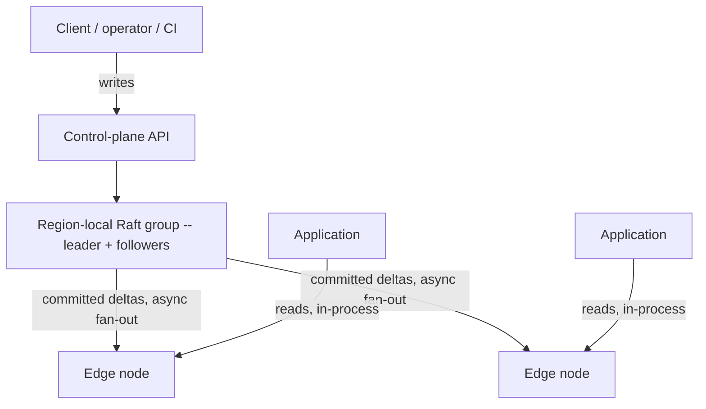
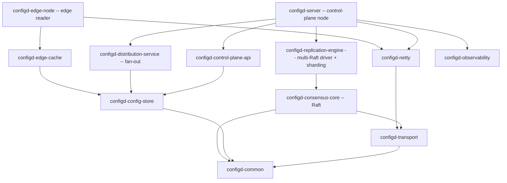

# Architecture Overview

Configd separates a strongly-consistent **control plane** (writes, via Raft) from a bounded-staleness
**data plane** (reads, from a lock-free in-process cache). This page is the onboarding summary; the
full treatment -- topology, sharding, security posture, the measured envelope -- is in
[`../architecture/architecture.md`](../architecture/architecture.md).

## Topology

v1 is a **single, region-local sharded-Raft cluster**: one Raft group by default (N=1), with
hash-within-scope sharding wired for horizontal scale (operator-managed leadership). It is **not** a
global/regional hierarchical-Raft topology -- that design was rejected (ADR-0030, ADR-0031) and never
built. Writes commit in the region-local root group; committed deltas fan out asynchronously to edge
readers that hold a local copy and take no part in consensus.

## Write path (linearizable, durable)

1. A client sends a write to the control-plane API.
2. The API authenticates, ACL-checks, rate-limits, and validates it.
3. It routes to a shard with `shardFor(scope, key)` and proposes to that Raft group's leader.
4. The entry replicates to a quorum and commits only after a durable majority fsync (no early ack).
5. The committed entry is applied to the state machine, then fanned out to the edges.

Overload is bounded: at roughly 1024 in-flight proposals the leader rejects new writes with HTTP 429
plus `Retry-After`.

## Read path (microsecond, in-process)

1. An application thread calls `LocalConfigStore.get(key)` on its local edge store.
2. That is a single volatile load of the current immutable snapshot pointer.
3. Followed by a HAMT traversal -- effectively constant time for practical key counts.
4. Zero allocation on a miss (a pre-allocated `ReadResult.NOT_FOUND` singleton).

Edge reads are sequentially consistent and bounded-stale, never linearizable. For read-after-write
correctness or the strong-read key class (`secure/`), the control plane serves a linearizable read
via Raft ReadIndex, failing closed (HTTP 503) if leadership is unconfirmed.

## Consistency model

- **Control-plane writes**: linearizable within a Raft group (per-key total order).
- **Edge reads**: bounded staleness; an `X-Configd-Stale` header is set while behind.
- **Monotonic reads**: enforced per client via `VersionCursor`.
- **Strong reads**: `secure/` keys are always read fresh (linearizable, fail-closed) -- this buys
  freshness, not confidentiality.
- **Cross-group order**: not guaranteed (each group has its own sequence).
- **Staleness tracking**: `StalenessTracker` transitions CURRENT -> STALE -> DEGRADED -> DISCONNECTED.

## Watches (v1)

The server side of the RFC 2 watch protocol is implemented on the edge endpoint: per-shard cursor
vectors, whole-target authorization (fail-closed), filtered delivery, and bounded revocation.
Guarantees: per-key and per-shard order (never cross-shard), at-least-once with `(gid, seq)` dedup.
Watches are N=1 in v1; cross-shard watches are v3. No conforming client driver ships yet -- the
protocol is stand-alone implementable from [`../rfc/driver-protocol/`](../rfc/driver-protocol/).

## Module layering

Dependencies point downward: everything rests on `configd-common`, and the runnable services at the
top wire the libraries together.

The test and verification harnesses (`configd-testkit`, `configd-linz`, `configd-jcstress`) depend on
the runtime modules, not the other way around. See the [Module Reference](Module-Reference.md) for
each module's purpose and key types.
